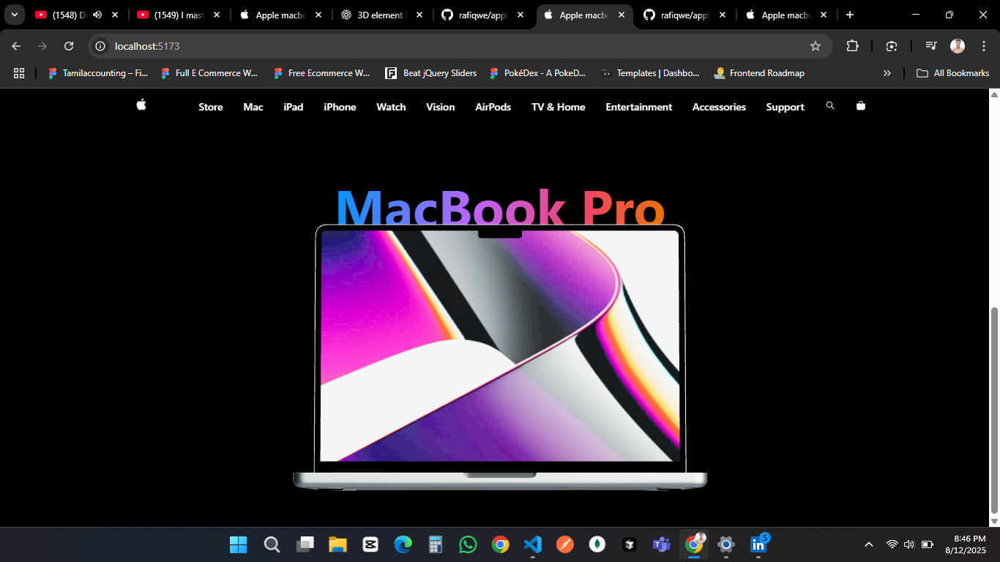

# Apple MacBook Pro Landing Page

A visually stunning, Apple-inspired **MacBook Pro landing page** built with React, Three.js, and GSAP animations.  
Designed for **desktop** viewing — mobile responsiveness is coming soon.

## 🚀 Live Demo
[https://apple-macbook-page.vercel.app/](https://apple-macbook-page.vercel.app/)

## 📸 Preview

## ✨ Features
- **Interactive 3D MacBook Model** with scroll animations
- **Smooth GSAP animations** for navigation & content
- **HDR environment lighting** for realistic reflections
- Apple-style gradients & typography
- Built with **React Three Fiber** and **@react-three/drei**

## 🛠 Tech Stack
- **React + Vite**
- **Three.js / @react-three/fiber**
- **@react-three/drei** (models, controls, textures)
- **GSAP** for animations

## 📂 Project Structure

├── public  
│ ├── mac.glb # 3D MacBook model  
│ ├── red.jpg # Screen texture  
├── src  
│ ├── components  
│ │ ├── Header.jsx  
│ │ ├── MacContainer.jsx  
│ ├── App.jsx  
│ ├── index.css  
│ ├── main.jsx  

## 📦 Installation & Setup
# Clone the repository
git clone https://github.com/rafiqwe/apple-landing-page.git
cd apple-landing-page

# Install dependencies
npm install

# Start development server
npm run dev

##⚠️ Note
This version is desktop-only. Mobile responsiveness is planned for a future update.

##📜 License
This project is licensed under the MIT License.

